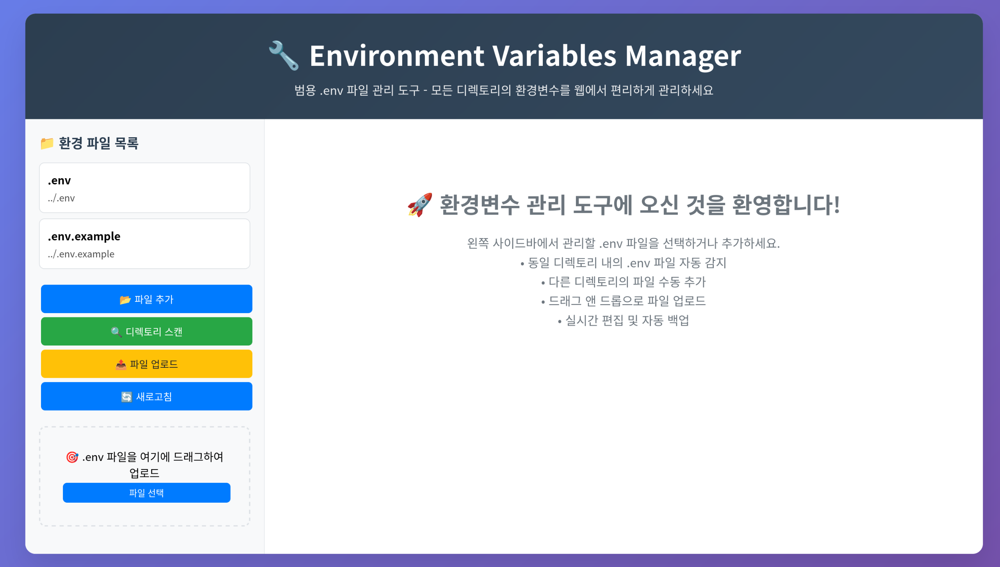
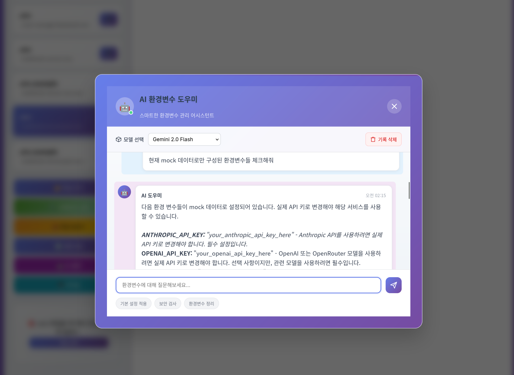
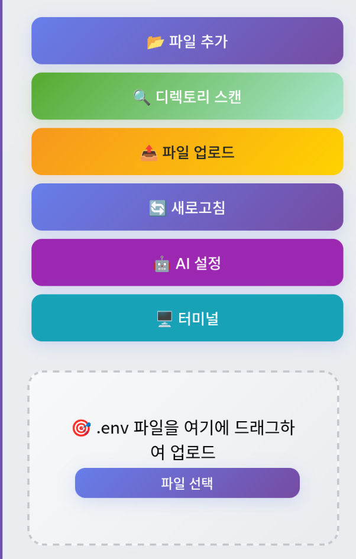
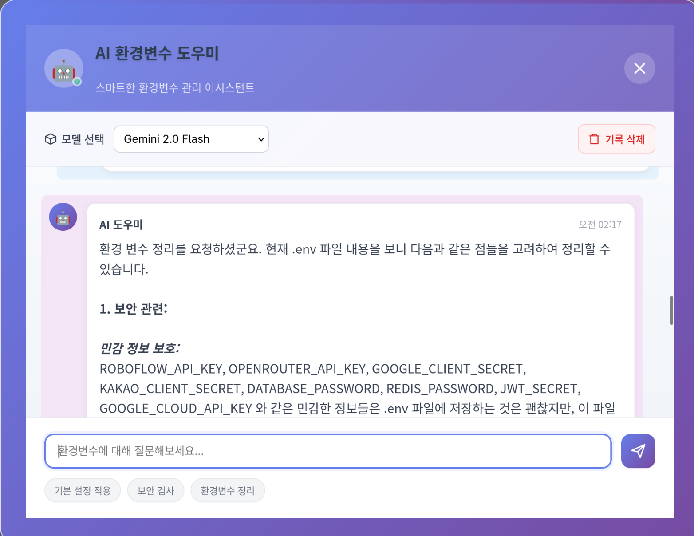
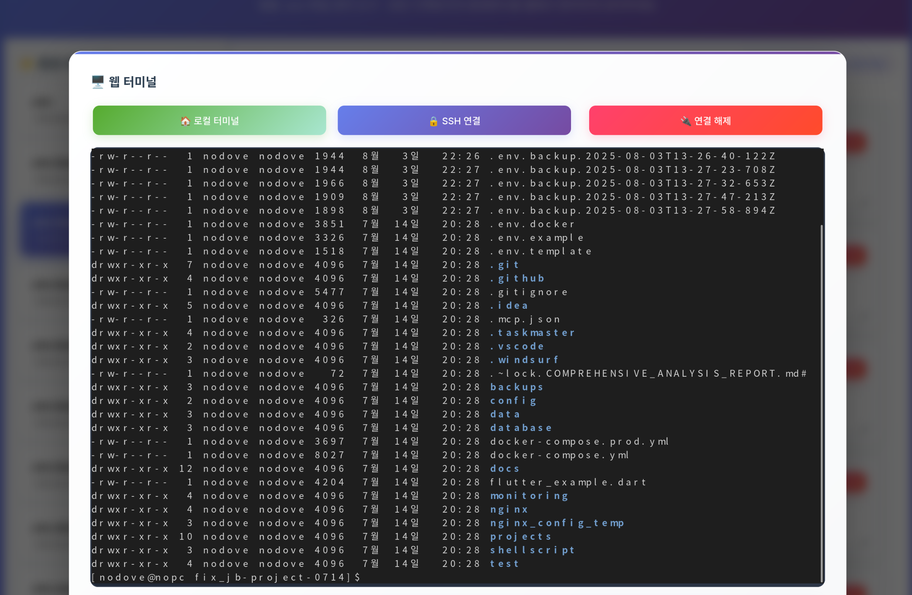
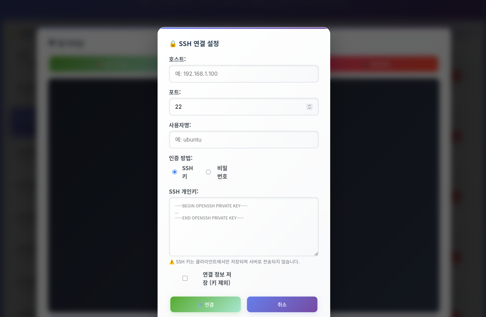
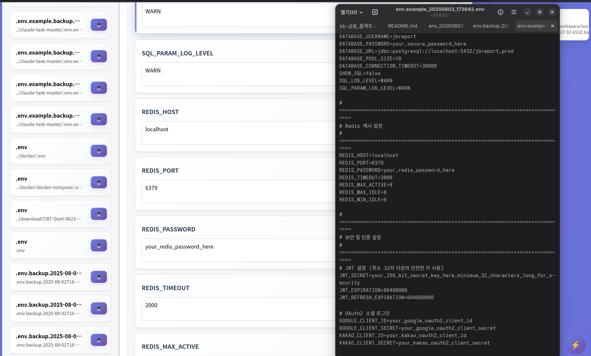

# KB 감정다이어리 - 환경변수 관리자 🔧

<div align="center">
  
</div>

## 📖 프로젝트 개요

**KB 감정다이어리 환경변수 관리자**는 프론트엔드, 백엔드, Docker 환경의 환경변수를 일관성 있게 관리하는 프로젝트 특화 도구입니다. 

### ✨ 프로젝트 특화 기능

-   🏗️ **KB 감정다이어리 프로젝트 전용**: 프로젝트 구조에 최적화된 관리
-   🔄 **프론트엔드-백엔드 동기화**: 관련 환경변수 자동 동기화
-   ✅ **일관성 검증**: 환경변수 값의 유효성 및 일치성 검사
-   📋 **카테고리별 관리**: 데이터베이스, 인증, API 등 용도별 분류
-   🎯 **스마트 매핑**: 프론트엔드 VITE_ 변수와 백엔드 설정 자동 연결

### 🌐 일반 기능
-   📁 **다중 파일 관리**: 모든 .env 파일을 하나의 인터페이스에서 관리
-   🤖 **AI 도우미**: GPT, Gemini, Claude 등을 통한 스마트 관리
-   🖥️ **통합 터미널**: SSH 및 로컬 터미널 지원
-   💾 **자동 백업**: 변경 전 안전한 백업
-   ⚡ **성능 모니터링**: 실시간 성능 추적

## 🏗️ KB 감정다이어리 프로젝트 구조

```
kb-MoodFinancial_Diary/
├── .env.example                      # 🐳 Docker compose 환경변수
├── frontend/
│   ├── .env.example                  # 🎨 Vite 프론트엔드 환경변수
│   └── src/                          # React + TypeScript
├── backend-main/
│   ├── .env.example                  # ⚙️ Spring Boot 백엔드 환경변수
│   └── src/main/java/               # Spring Boot 소스
├── env-manager/                      # 🔧 환경변수 관리자
│   ├── config/
│   │   ├── project-schema.js         # 프로젝트 스키마 정의
│   │   └── project-env-manager.js    # 프로젝트 환경변수 관리자
│   ├── public/                       # 웹 인터페이스
│   ├── cli.js                        # CLI 도구
│   └── server.js                     # 웹 서버
└── docker-compose.yml                # Docker 설정
```

## 🚀 빠른 시작

### 프로젝트 루트에서 실행

```bash
# 웹 서버 시작 (포트 3001)
npm run env-manager

# 또는 개별 명령어들
npm run env:start    # 서버 시작
npm run env:dev      # 개발 모드 (자동 재시작)
npm run env:status   # 프로젝트 환경변수 현황 확인
npm run env:validate # 일관성 검증
npm run env:sync     # 자동 동기화
npm run env:backup   # 백업 생성
```

### 웹 인터페이스
```
http://localhost:3001
```

## 📊 환경변수 카테고리 및 매핑

### 🗄️ 데이터베이스 (DATABASE)
```
DB_HOST=localhost              # 🏠 데이터베이스 호스트
DB_PORT=3306                   # 🚪 데이터베이스 포트
DB_NAME=kb_mood_diary          # 📦 데이터베이스 이름
DB_USER=root                   # 👤 데이터베이스 사용자
DB_PASSWORD=password           # 🔐 데이터베이스 비밀번호
```

### 🔐 인증 및 보안 (AUTH)
```
JWT_SECRET=your-256-bit-secret # 🔑 JWT 토큰 비밀키 (32자 이상)
```

### 🌐 OAuth 소셜 로그인 (OAUTH)
```
# Google OAuth (백엔드 ↔ 루트)
OAUTH2_GOOGLE_CLIENT_ID ↔ GOOGLE_CLIENT_ID
OAUTH2_GOOGLE_CLIENT_SECRET ↔ GOOGLE_CLIENT_SECRET

# Kakao OAuth (백엔드 ↔ 루트)  
OAUTH2_KAKAO_CLIENT_ID ↔ KAKAO_CLIENT_ID
OAUTH2_KAKAO_CLIENT_SECRET ↔ KAKAO_CLIENT_SECRET
```

### 🗺️ API 서비스 (API)
```
VITE_KAKAO_MAP_KEY             # 🗺️ 카카오 지도 API 키 (프론트엔드 전용)
```

### 🔗 URL 및 엔드포인트 (URL) - 자동 동기화
```
# API URL 매핑 (프론트엔드)
VITE_API_BASE_URL ↔ REACT_APP_API_URL
기본값: http://localhost:8090

# CORS 설정 (백엔드)
FRONTEND_URL ↔ CORS_ALLOWED_ORIGINS  
기본값: http://localhost:8084
```

### ⚙️ 서버 설정 (SERVER)
```
BACKEND_PORT=8080              # 🌐 백엔드 서버 포트
FRONTEND_PORT=3000             # 🎨 프론트엔드 개발 포트
NGINX_PORT=80                  # 🌐 Nginx 포트
SPRING_PROFILES_ACTIVE=dev     # 🏃 Spring 프로필
```

## 🔄 자동 동기화 규칙

### URL 매핑
- `VITE_API_BASE_URL` (프론트) ↔ `REACT_APP_API_URL` (프론트)
- `FRONTEND_URL` (백엔드) ↔ `CORS_ALLOWED_ORIGINS` (백엔드)

### OAuth 매핑  
- `OAUTH2_KAKAO_CLIENT_ID` ↔ `KAKAO_CLIENT_ID`
- `OAUTH2_GOOGLE_CLIENT_ID` ↔ `GOOGLE_CLIENT_ID`

### 파일별 변수 배치 규칙
- **VITE_**, **REACT_APP_** 접두사 → 프론트엔드 파일
- **OAUTH2_** 접두사 → 백엔드 파일  
- **DB_**, **REDIS_** 접두사 → 백엔드 + 루트 파일
- **_PORT** 포함 → 루트 파일

## 🖥️ CLI 사용법

```bash
# 현재 프로젝트 환경변수 상태 확인
npm run env:status

# 예시 출력:
📋 환경변수 현황:
   총 파일 수: 3
   총 환경변수 수: 25  
   검증 이슈: 2개
   동기화 제안: 3개

📁 파일별 현황:
   ✅ frontend: 8개 변수 (frontend/.env.example)
   ✅ backend: 15개 변수 (backend-main/.env.example)  
   ✅ root: 12개 변수 (.env.example)
```

```bash
# 일관성 검증
npm run env:validate

# 자동 동기화 (제안사항 적용)
npm run env:sync

# 전체 프로젝트 백업
npm run env:backup
```

## 🌐 웹 인터페이스

### 📁 파일 관리 탭
- 개별 .env 파일 편집
- 실시간 문법 강조
- 드래그 앤 드롭 업로드

### 🏗️ 프로젝트 탭  
- 프로젝트 전체 상태 요약
- 파일별 변수 수 및 상태 표시
- 일관성 검증 및 동기화 버튼
- 카테고리별 환경변수 현황

## 🛡️ 검증 및 보안 규칙

### ✅ 필수 검증
- `DB_HOST`, `DB_NAME`, `JWT_SECRET` 필수 입력
- 포트 번호 숫자 형식 검증
- URL 형식 검증 (http/https)
- JWT 시크릿 최소 32자 검증

### 🔒 보안 주의사항
1. **JWT_SECRET**: 32자 이상의 안전한 비밀키 사용
2. **데이터베이스 비밀번호**: 8자 이상 권장
3. **OAuth 키**: 프로덕션 환경에서 실제 값으로 교체
4. **로컬 개발용**: 이 도구는 로컬 개발 환경에서만 사용

## 🔌 프로젝트 전용 API

```http
GET  /api/project/env-status      # 프로젝트 환경변수 현황
POST /api/project/validate        # 일관성 검증  
POST /api/project/sync           # 환경변수 동기화
PUT  /api/project/variable/:name  # 특정 변수 업데이트
GET  /api/project/categories      # 카테고리별 조회
POST /api/project/backup          # 프로젝트 백업
```

## 🧪 테스트

```bash
cd env-manager

# 의존성 설치
npm install

# 전체 테스트 실행
npm test

# 개별 테스트
npm run test:unit         # 단위 테스트
npm run test:integration  # 통합 테스트  
npm run test:e2e         # E2E 테스트

# 코드 품질
npm run lint             # ESLint 검사
npm run format           # Prettier 포맷팅
```

## 🤝 개발 참여

1. 환경변수 스키마 수정: `config/project-schema.js`
2. 새로운 카테고리 추가: 스키마에 카테고리 정의
3. 매핑 규칙 추가: `variableMappings`에 관계 정의
4. 검증 규칙 추가: `validationRules`에 검증 로직 추가

## 📝 라이센스

MIT License - KB 감정다이어리 프로젝트 전용 환경변수 관리 도구

## 🖼️ 주요 기능 스크린샷

### 1. 메인 대시보드



_여러 환경변수 파일을 한눈에 보고 관리할 수 있는 메인 인터페이스_

### 2. 환경변수 편집기



_개별 환경변수를 실시간으로 편집하고 저장할 수 있는 편집기_

### 3. 파일 업로드 및 스캔


_드래그 앤 드롭으로 파일 업로드하거나 디렉토리 스캔을 통한 자동 등록_

### 4. 터미널 통합



_웹에서 직접 터미널에 접근하여 명령어 실행 및 파일 관리_

### 5. AI 도우미 설정



_다양한 AI 모델 API 키 설정 및 선호 모델 선택_

### 6. AI 채팅 인터페이스



_AI와 대화하며 환경변수 관리에 대한 조언과 자동 수정 기능_

### 7. 성능 모니터링


_실시간 시스템 리소스 모니터링 및 성능 메트릭 추적_

### 8. 고급 기능들



_백업, 다운로드, 환경별 설정 파일 생성 등 고급 관리 기능_

## 🚀 시작하기

### 필수 요구사항

-   Node.js 16.0 이상
-   npm 또는 yarn
-   최신 웹 브라우저 (Chrome, Firefox, Safari, Edge)

### 설치 및 실행

1. **프로젝트 클론**

    ```bash
    git clone [repository-url]
    cd env_variables_manager
    ```

2. **의존성 설치**

    ```bash
    npm install
    ```

3. **환경 설정**

    ```bash
    cp .env.example .env
    # 필요에 따라 .env 파일 수정
    ```

4. **개발 서버 실행**

    ```bash
    npm run dev
    ```

5. **브라우저에서 접속**
    ```
    http://localhost:3001
    ```

### 프로덕션 배포

```bash
npm start
```

## 🔧 주요 기능 상세

### 1. 환경변수 파일 관리

#### 파일 추가 방법

-   **직접 경로 입력**: 특정 파일 경로를 직접 입력하여 등록
-   **디렉토리 스캔**: 지정된 디렉토리에서 .env 파일 자동 탐지
-   **파일 업로드**: 드래그 앤 드롭으로 파일 업로드
-   **자동 탐지**: 프로젝트 실행 시 주변 디렉토리에서 자동 탐지

#### 편집 기능

-   ✏️ 실시간 환경변수 편집
-   ➕ 새로운 환경변수 추가
-   🗑️ 기존 환경변수 삭제
-   💾 자동 백업 생성
-   📥 다양한 형태로 다운로드

### 2. AI 도우미 통합

#### 지원하는 AI 모델

-   **OpenAI**: GPT-4o, GPT-4 Turbo, GPT-3.5 Turbo
-   **Google Gemini**: Gemini 2.0 Flash, Gemini 1.5 Pro/Flash
-   **OpenRouter**: Claude 3.5 Sonnet, Llama 3.1, Mistral Large

#### AI 기능

-   🤖 환경변수 관련 질문 답변
-   ⚡ 자동 환경변수 수정/추가/삭제
-   🔒 보안 모범 사례 제안
-   📋 설정 파일 구조화 조언
-   🎯 현재 프로젝트 맞춤형 답변

### 3. 통합 터미널

#### 터미널 기능

-   🖥️ 로컬 터미널 접근
-   🌐 SSH 원격 서버 연결
-   📁 파일별 디렉토리 터미널 열기
-   🔄 실시간 명령어 실행
-   📱 반응형 터미널 인터페이스

### 4. 성능 모니터링

#### 모니터링 항목

-   💾 메모리 사용량 추적
-   ⏱️ API 응답 시간 측정
-   📊 사용자 상호작용 분석
-   🚨 성능 알림 및 경고
-   📈 Core Web Vitals 측정

### 5. 보안 및 권한 관리

#### 보안 기능

-   🔐 민감한 정보 자동 마스킹
-   🛡️ 파일 권한 검증
-   📋 권한 문제 해결 가이드
-   🔒 안전한 백업 관리
-   ⚠️ 보안 경고 시스템

## 📁 프로젝트 구조

```
env_variables_manager/
├── 📄 server.js              # Express 서버 메인 파일
├── 📁 public/                # 클라이언트 정적 파일
│   ├── 🌐 index.html         # 메인 HTML 파일
│   ├── ⚡ app.js             # 클라이언트 JavaScript
│   └── 🎨 style.css         # 스타일시트
├── 📁 tests/                 # 테스트 파일
│   ├── 📁 unit/              # 단위 테스트
│   ├── 📁 integration/       # 통합 테스트
│   └── ⚙️ setup.js          # 테스트 설정
├── 📁 images/                # 프로젝트 스크린샷
├── 📁 uploads/               # 업로드된 파일 저장소
├── 📄 package.json           # 프로젝트 의존성
├── 📄 .env.example          # 환경변수 템플릿
└── 📄 README.md             # 프로젝트 문서 (이 파일)
```

## 🛠️ 개발 도구 및 스크립트

### NPM 스크립트

```bash
# 개발 서버 (nodemon 사용)
npm run dev

# 프로덕션 서버
npm start

# 테스트 실행
npm test

# 테스트 커버리지
npm run test

# 단위 테스트만 실행
npm run test:unit

# 통합 테스트만 실행
npm run test:integration

# E2E 테스트 (Cypress)
npm run test:e2e

# E2E 테스트 GUI 모드
npm run test:e2e:open

# 코드 린팅
npm run lint

# 코드 자동 수정
npm run lint:fix

# 코드 포맷팅
npm run format
```

### 개발 환경 설정

프로젝트는 다양한 개발 도구를 포함합니다:

-   **ESLint**: 코드 품질 관리
-   **Prettier**: 코드 포맷팅
-   **Jest**: 단위/통합 테스트
-   **Cypress**: E2E 테스트
-   **Nodemon**: 개발 시 자동 재시작

## 🔌 API 엔드포인트

### 환경변수 파일 관리

```http
GET    /api/env-files              # 파일 목록 조회
POST   /api/env-files              # 새 파일 등록
GET    /api/env-files/:id          # 특정 파일 내용 조회
PUT    /api/env-files/:id          # 파일 내용 업데이트
DELETE /api/env-files/:id          # 파일 등록 해제
POST   /api/env-files/:id/backup   # 백업 생성
GET    /api/env-files/:id/download # 파일 다운로드
```

### 파일 관리

```http
POST /api/upload           # 파일 업로드
POST /api/scan-directory   # 디렉토리 스캔
```

### 시스템 모니터링

```http
GET  /api/health    # 서버 상태 확인
GET  /api/metrics   # 성능 메트릭 조회
POST /api/metrics   # 클라이언트 메트릭 전송
```

## 🧪 테스트

프로젝트는 포괄적인 테스트 스위트를 포함합니다:

### 테스트 구조

-   **단위 테스트**: 개별 함수 및 모듈 테스트
-   **통합 테스트**: API 엔드포인트 및 워크플로우 테스트
-   **E2E 테스트**: 전체 사용자 시나리오 테스트

### 테스트 커버리지

프로젝트는 다음 커버리지 목표를 설정합니다:

-   **브랜치**: 80% 이상
-   **함수**: 80% 이상
-   **라인**: 80% 이상
-   **구문**: 80% 이상

## 🤝 기여하기

프로젝트에 기여하고 싶으시다면:

1. 프로젝트를 포크합니다
2. 기능 브랜치를 생성합니다 (`git checkout -b feature/AmazingFeature`)
3. 변경사항을 커밋합니다 (`git commit -m 'Add some AmazingFeature'`)
4. 브랜치에 푸시합니다 (`git push origin feature/AmazingFeature`)
5. Pull Request를 생성합니다

### 개발 가이드라인

-   코드 스타일: ESLint + Prettier 설정 준수
-   테스트: 새로운 기능에 대한 테스트 작성 필수
-   문서화: README 및 코드 주석 업데이트
-   커밋 메시지: 명확하고 설명적인 커밋 메시지 작성

## 📝 라이선스

이 프로젝트는 [MIT 라이선스](LICENSE) 하에 배포됩니다.

## 🙏 감사의 말

이 프로젝트는 다음 오픈소스 라이브러리들을 사용합니다:

-   **Express.js**: 웹 서버 프레임워크
-   **Socket.io**: 실시간 통신
-   **node-pty**: 터미널 에뮬레이션
-   **SSH2**: SSH 연결 지원
-   **Multer**: 파일 업로드 처리
-   **Jest**: 테스트 프레임워크
-   **Cypress**: E2E 테스트 도구

## 📞 지원 및 연락

문제가 발생하거나 질문이 있으시면 다음을 통해 연락주세요:

-   📧 이메일: [your-email@example.com]
-   🐛 이슈 트래커: [GitHub Issues](../../issues)
-   💬 토론: [GitHub Discussions](../../discussions)

## 🗺️ 로드맵

### 향후 계획

-   [ ] 🔧 **멀티 테넌트 지원**: 여러 팀/조직을 위한 분리된 환경
-   [ ] 🔄 **Git 통합**: 환경변수 변경사항 자동 커밋
-   [ ] 🌍 **국제화**: 다국어 지원 (영어, 일본어 등)
-   [ ] 📱 **모바일 앱**: React Native 기반 모바일 앱
-   [ ] 🔔 **알림 시스템**: 변경사항 및 보안 알림
-   [ ] 🔐 **암호화**: 민감한 데이터 암호화 저장
-   [ ] 📊 **고급 분석**: 사용 패턴 및 통계 분석
-   [ ] 🔌 **플러그인 시스템**: 확장 가능한 플러그인 아키텍처

---

<div align="center">
  <p>Made by nodove</p>
</div>
